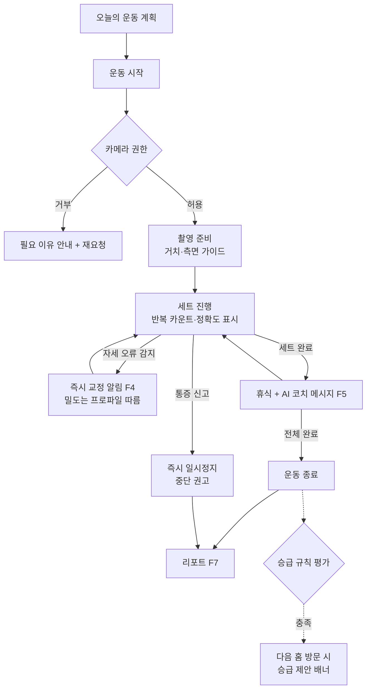
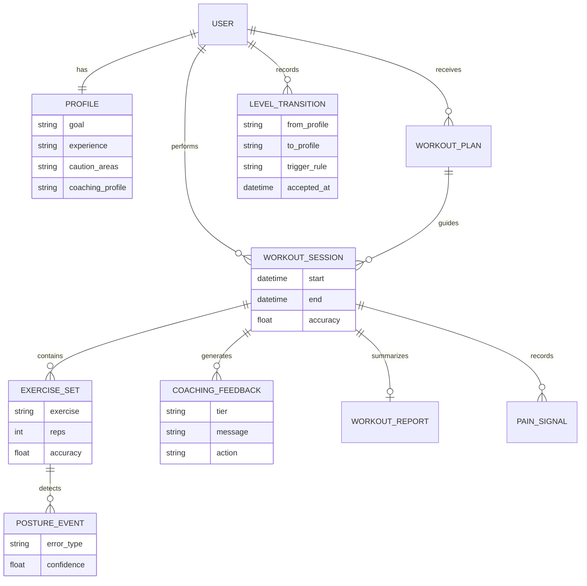
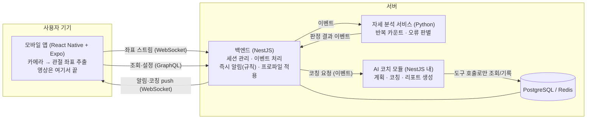

# FormCoach 기획서

> **v3.0 전면 재작성 (2026-08-17).** 한 줄 요약: **홈트레이닝 초보~중급자가 "지금 내 자세가 맞는지, 오늘 얼마나 해야 하는지, 어느 정도 성장하고 있는지"를 한 곳에서 추적·분석·피드백받는 모바일 앱.**
>
> 이 프로젝트는 두 가지 목적을 갖는다: ① 취업 포트폴리오(당근 백엔드 — Part 13), ② 졸업논문(Part 14). 이 문서는 "나중에 바꾸기 힘든 것"만 미리 정한다. 화면 디테일, API 필드, 모델 하이퍼파라미터처럼 바꾸기 싼 것은 개발하면서 정한다. 기술 상세는 [기술설계서.md](./기술설계서.md)에 분리한다.

---

## 목차

- **Part 1. 문제 정의** — 누구의 어떤 문제인가 (연구 근거 포함)
- **Part 2. 시장과 경쟁** — 유사 서비스 분석과 우리의 차별점
- **Part 3. 목표와 성공 지표**
- **Part 4. 범위 (Scope)** — In / Out / Later
- **Part 5. 서비스 정의** — 컨셉, **수준별 기능 분리**, 시나리오, 기능 목록, 정책
- **Part 6. 유저 스토리와 사용자 플로우**
- **Part 7. 요구사항 명세** — FR / NFR
- **Part 8. 화면 구성** — IA와 10화면
- **Part 9. 데이터 스케치** — ERD
- **Part 10. 기술 검토와 결정 기록 (ADR)**
- **Part 11. 시스템 구성 스케치**
- **Part 12. 개발 계획** — 마일스톤·리스크·역할 (2026-08-17 기준 재산정)
- **Part 13. 당근 Lessons & Tutoring 공고 연결**
- **Part 14. 논문 연결** — 연구 질문
- **Part 15. 미해결 질문**
- **부록 A. 팀 합의 필요 항목** / **부록 B. 참고 문헌·자료**

---

# Part 1. 문제 정의

## 1.1 대상 사용자 (Who)

**"헬스장 PT는 부담스럽지만, 혼자 하는 운동이 맞는지 불안한 홈트레이닝 초보~중급자."**

구체적으로:

- 20~30대, 집에서 맨몸 운동(스쿼트, 런지, 푸시업)을 주 2~3회 하려는 사람
- PT 가격(회당 5~10만 원)이 부담스러워 유튜브 영상을 보며 따라 하는 사람
- 스마트폰을 거치할 수 있는 환경에서 운동하는 사람

이번 버전에서 대상을 한 단계 더 쪼갠다 — **수준이 다르면 필요한 것이 다르기 때문이다**:

| 수준 | 정의 (조작적) | 핵심 니즈 |
|---|---|---|
| **입문** | 맨몸 운동 경험 3개월 미만 또는 자세 교정을 받아본 적 없음 | "내 자세가 맞나?" — **자세부터**. 다치지 않고 기본기를 만드는 것 |
| **성장** | 기본 동작 수행 가능, 3개월 이상 지속 경험 | "얼마나·어떻게 늘려야 하나?" — **성장이 보이는 것**. 정체와 지루함 극복 |

"모두"가 아니다. 다음은 대상이 **아니다**: 중량 운동 위주의 상급자, 재활이 필요한 환자, 카메라 거치가 불가능한 환경의 사용자.

## 1.2 문제 (What)

이 사용자들이 지금 겪는 불편 세 가지. 각각에 근거를 붙인다 (출처는 부록 B).

**① 자세가 맞는지 모른다 — 그리고 이건 부상 문제다.**
유튜브를 보고 따라 해도 내 무릎이 안쪽으로 모이는지, 상체가 숙여지는지 스스로 볼 수 없다. 스포츠의학 문헌은 dynamic knee valgus(무릎 모임)를 ACL 손상의 대표적인 **수정 가능한** 위험 요인으로 확인했고 [B-6], 과도한 체간 전경사는 척추·고관절 부하 증가와 연결된다 [B-7]. "자세를 봐주는 눈"의 부재는 불편이 아니라 위험이다.

**② 피드백이 없으니 지속하지 못한다.**
건강·피트니스 앱 사용자의 중앙값 70%가 100일 이내에 사용을 중단하고(18개 연구, N=525,824 메타분석) [B-4], 앱 기반 건강 개입의 통합 이탈률은 43%다 [B-5]. 업계 통계로는 피트니스 앱의 Day-30 리텐션이 평균 3% 수준(상위 앱 25%)이며 해지 사유 1위가 "동기 상실"(38%)이다 [B-8, 산업 리포트]. 반대로 운동 중 실시간 피드백은 수행을 즉각 개선한다는 메타분석 근거가 있다(저항운동 피드백 제공 시 수행 지표 +8.4%, g=0.63) [B-2]. 스쿼트에서는 실시간 연속 시각 피드백이 동작 정확도·일관성을 유의하게 높였다 [B-3]. **피드백은 지속의 조건인데, 홈트에는 피드백이 없다.**

**③ 오늘 얼마나 해야 하는지, 늘고 있는지 모른다.**
내 체력, 지난 수행, 컨디션을 반영한 "오늘의 계획"이 없어 항상 같은 횟수를 하거나 감으로 정한다. 기록이 흩어져 있으니 성장이 보이지 않고, 성장이 안 보이면 그만둔다(②와 연결).

**현재의 대안과 그 한계:**

| 대안 | 한계 |
|---|---|
| 유튜브 홈트 영상 | 일방향. 내 자세를 봐주지 않는다 |
| 무카메라 AI 운동 앱 (콰트, 플랜핏, Fitbod류) | 계획·기록은 좋지만 **자세를 못 본다** — ①이 그대로 남는다 |
| 카메라 자세 인식 서비스 (일부 존재) | 대부분 TV·전용 하드웨어 종속이거나 종료됨(Part 2). 살아남은 것도 "무릎 각도 몇 도" 수준 고정 문구 — 내 이력·수준을 모른다 |
| 헬스장 PT | 가장 좋지만 비싸고, 예약·이동이 필요하다 |

## 1.3 왜 지금 (Why now)

- 스마트폰 **온디바이스** 실시간 자세 인식(MediaPipe 등)이 별도 장비 없이 가능해졌다 — 폰 카메라만 있으면 된다. 포즈 추정 기반 폼 오류 감지는 실환경 영상에서 F1 0.85~0.87 수준이 학계에서 보고됐다 [B-1].
- LLM의 도구 호출(tool calling)로 "이력을 기억하고 근거를 말하는 코치"를 저비용으로 구현할 수 있게 됐다. 단, LLM 운동 코칭 연구는 아직 초기 단계로 표준 평가 체계가 없다 [B-9] — 이건 리스크이자 **논문 기여의 공간**이다(Part 14).
- 경쟁 지형이 비었다: 카메라 폼 교정 1세대가 정리되면서(Part 2), "모바일 온디바이스 실시간 폼 교정 + 개인화"는 현재 소비자 시장에서 거의 빈 포지션이다.

## 1.4 풀지 않을 문제 (Non-goals)

- 식단·체중 관리, 수면 등 운동 외 웰니스
- 재활·의료 (진단·치료 표현을 쓰지 않는다 — 정책 5.5-3)
- 소셜 (친구·랭킹·공유), 상용 결제·구독
- 상급자용 중량 운동 코칭 (바벨 경로 분석 등)

---

# Part 2. 시장과 경쟁 — 유사 서비스 분석과 차별점

2026-08 기준 웹 조사 결과 요약 (상세 출처: 부록 B-10). 판을 먼저 보고 우리 자리를 정한다.

## 2.1 경쟁 서비스 지형

| 서비스 | 방식 | 실시간 자세 피드백 | 개인화 계획 | 성장 추적 | 상태 (2026-08) |
|---|---|---|---|---|---|
| **Zing Coach** (글로벌) | 모바일 앱 | O — 영상은 기기 처리, 키포인트는 서버 저장 | O (체크인 기반) | O | 운영 중 |
| **Kemtai** (글로벌) | 웹 브라우저 | O — 엣지 처리 명시 | O (임상의 배정) | O | 운영 중, **물리치료 B2B로 피벗** |
| **Tempo** (미국) | 전용 하드웨어 | O (3D 센서) | O | O | 운영 중, HW $395~2,495 종속 |
| **Peloton Guide** (미국) | TV 카메라 기기 | O — 온디바이스 명시 | 부분 | O | **2025-07 단종** |
| Freeletics · Fitbod · Apple Fitness+ · 콰트 · 플랜핏 | 모바일 앱 | **X — 카메라 없음** | O | O | 운영 중 (주류) |
| **삼성 스마트 트레이너** | 스마트TV + USB캠 | O | 콘텐츠 추천 수준 | O (워치 중심) | 운영 중 (TV 한정) |
| **엑서사이트** (아이픽셀) | LG TV + 모바일 | O | 미확인 | 미확인 | 운영 중, 재활판은 병원 B2B |
| 카카오VX 스마트홈트 · 하우핏 | 모바일/TV | O | 커리큘럼형 | 부분 | **종료 (2023~2024)** |

## 2.2 판에서 읽히는 것 세 가지

1. **"모바일 온디바이스 실시간 폼 교정"은 거의 빈 포지션이다.** 이 조건을 충족하는 현역 소비자 서비스는 사실상 Zing Coach 하나이고, 그마저 키포인트를 서버에 저장한다. 나머지는 전용 하드웨어(Tempo), TV(삼성·엑서사이트), 웹 B2B(Kemtai)이거나 단종·종료됐다.
2. **"자세 분석 → 개인화 계획 → 성장 추적"의 폐루프를 구현한 소비자 서비스는 확인되지 않았다.** 카메라 있는 쪽은 개인화·추적이 약하고(폼 데이터가 계획에 반영되는지 불명확), 개인화·추적이 강한 주류 앱들은 카메라가 아예 없다. 한국에는 3요소를 결합한 현역 서비스가 없다.
3. **경고 신호도 명확하다.** 카메라 폼 교정 도전자들의 공통 궤적은 소비자 앱 소멸(Onyx), 하드웨어 단종(Peloton Guide), 의료 B2B 피벗(Kemtai·Exer·엑서사이트 케어), 국내 1세대 전멸(스마트홈트·하우핏)이다. 상용 서비스로 살아남기 어려운 시장이라는 뜻이다. — **우리의 목적은 상용 생존이 아니라 논문+포트폴리오이므로 이 리스크의 성격이 다르지만**, "왜 다들 실패했나"(하드웨어 비용, 인식 품질, 콘텐츠 제작비)는 설계에서 피해 간다: 전용 하드웨어 없음, 인식 실패 시 피드백 삼가기(정책 5.5-5), 콘텐츠가 아닌 데이터·코칭 중심.

## 2.3 우리의 차별점 (그리고 아닌 것)

| # | 차별점 | 근거 |
|---|---|---|
| 1 | **완전 온디바이스 + 영상 무전송을 구조로 보장하고 전면에 명시** — 좌표(숫자)만 서버로 (ADR-1) | 이걸 검증 가능하게 명시하는 서비스는 글로벌 3곳뿐, 국내 0곳 (2.2-3). Zing Coach조차 키포인트를 서버에 저장하지만, 우리는 운영 세션 좌표를 처리 후 즉시 폐기한다 |
| 2 | **폐루프** — 자세 분석 결과(정확도·오류 패턴)가 다음 계획과 리포트에 순환 반영 | 이 폐루프를 구현한 소비자 서비스 미확인 (2.2-2) |
| 3 | **수준별 코칭 프로파일** — 입문은 자세 중심, 성장은 과부하·추세 중심 (5.2) | 기존 서비스는 수준 구분이 콘텐츠 난이도 수준. 피드백 밀도·계획 규칙 자체를 바꾸는 곳 없음 |
| 4 | **근거를 말하는 코치** — 모든 계획·코칭에 "왜"를 붙이고, 그 근거가 도구 호출 로그로 남는다 (ADR-5) | 고정 문구형 서비스와의 차이. 논문 RQ2의 실험 축 |

차별점이 **아닌 것**: 인식 기술 자체(MediaPipe는 누구나 쓴다), 운동 콘텐츠 양, 하드웨어. 여기에 시간을 쓰지 않는다.

---

# Part 3. 목표와 성공 지표

## 3.1 프로젝트의 세 가지 목표

1. **사용자 가치:** 홈트 초보~중급자가 자세·분량·성장을 한 곳에서 피드백받아, 다치지 않고 꾸준히 운동하게 한다.
2. **취업 포트폴리오:** 이벤트 기반 실시간 백엔드 + Tool-using AI Agent 설계·운영 역량을 실증한다 (당근 공고 매핑 — Part 13).
3. **논문:** RQ 3개(아키텍처 / 코칭 품질 / 판별 모델)에 대해 측정 가능한 답을 낸다 (Part 14).

## 3.2 성공 지표

"열심히 만들었다"로 끝나지 않도록, 판정 가능한 숫자로 정한다.

| # | 지표 | 목표 | 측정 방법 |
|---|---|---|---|
| S1 | 실시간 피드백 속도 | 오류 **확정**(안정화 완료) → 화면 피드백까지 P95 **300ms 이내**. 사용자 체감(오류 시작→표시, 안정화 창 포함)은 P95 800ms·최대 1초 | 시스템 로그 측정 (측정 명세: 기술설계서 §5.5) |
| S2 | 동시 처리 능력 | 가상 동시 세션 **100개**에서 피드백 지연 목표 유지. 도메인 이벤트(세트 완료·통증·종료·피드백)는 **유실 0**, 프레임 이벤트는 드롭율 별도 보고 | 부하 테스트 |
| S3 | 자세 판별 정확도 | 스쿼트 **1차 오류 2종**에 대해 F1 평균 **0.8 이상** — 최종 선택 모델의 개발 목표 (미달 시 오류별 F1 + 한계 논의로 보고) | LOSO(leave-one-subject-out) 교차검증, 피험자별 F1 병기 |
| S4 | 반복 카운트 정확도 | 오차율 **5% 이내** | 테스트 영상 대비 |
| S5 | 코칭 품질 | 블라인드 평가에서 Tool-using Agent(C)가 고정 문구(A) **및 단순 LLM(B)** 대비 높은 점수 — 유의성 + 사전 정의한 최소 효과크기. **핵심 가설은 C>B** (이력·도구 접근의 기여 입증) | 평가자 8인 이상, 평가자 내 반복측정 블라인드 평가 |
| S6 | 완성도 게이트 | **10월 중순까지 스쿼트 E2E 데모** — M1 완료 기준(12.1)과 동일 정의 | 데모 시연 |
| S7 | 논문 | 12월 초고 완성 (마감일 Q1 확인 후 조정) | — |

S6은 일정 게이트다. 이 시점에 E2E가 안 되면 Part 4의 "Later" 항목을 전부 잘라낸다.

참고: 사용자 리텐션(재사용률)은 이 프로젝트의 성공 지표로 **잡지 않는다**. 5개월짜리 학술 프로젝트에서 측정 불가능하고, 측정 못 할 지표는 지표가 아니다. 대신 "지속을 돕는 메커니즘"(피드백·성장 가시화)이 작동하는지를 S5(코칭 품질)와 소규모 사용자 평가로 본다.

---

# Part 4. 범위 (Scope)

범위 폭주를 막기 위해 In / Out / Later를 명시한다. 범위가 바뀌면 이 표를 갱신하고 변경 사실을 남긴다.

## In — 이번에 만든다 (MVP)

| 기능 | 비고 |
|---|---|
| 프로필·수준 등록 (목표·경험·주의 부위) | 개인화와 수준 분리의 입력값 |
| **수준별 코칭 프로파일 — 입문/성장 2단계** | 같은 파이프라인, 프로파일 설정 차이로 구현 (ADR-7) |
| AI 운동 계획 생성 | "오늘 뭘 얼마나" + 추천 이유. 수준 프로파일 반영 |
| 실시간 운동 세션 — **스쿼트** | 온디바이스 자세 인식, 반복 카운트, 세트 관리 |
| 실시간 자세 교정 피드백 | 즉시 알림(규칙) + 세트 사이 AI 코치 메시지(개인화) |
| 통증 신고와 안전 중단 권고 | 안전 정책 5.5 |
| 운동 결과 리포트 | 수준별 템플릿. 기본 리포트 즉시 + AI 리포트 비동기 |
| 운동 이력·추세 조회 | 성장 가시화 — 문제 ③의 답 |

## Out — 이번에 안 한다 (+이유)

| 항목 | 이유 |
|---|---|
| 웹 버전 | 모바일 앱으로 전환(ADR-6). 운동은 폰 거치 환경이 자연스럽고 실측 기기 고정(재현성)도 쉽다 |
| 원본 영상 저장·업로드 | 프라이버시 리스크와 인프라 비용. 좌표만 다룬다 (ADR-1) |
| 3단계 이상 수준 세분화 (고급/전문가) | 입문/성장 2단계로 가설 검증이 먼저. 세분화는 데이터가 쌓인 뒤 |
| 소셜 기능 (친구, 랭킹, 공유) | 핵심 가설(코칭 품질)과 무관 |
| 식단·체중 관리 | Non-goal (1.4) |
| 회원 결제·구독 | 상용화 목적 아님 |

## Later — 검증되면 한다

| 항목 | 조건 |
|---|---|
| 런지 또는 푸시업 추가 (**최대 1종**) | 스쿼트 E2E 완성(S6) 이후 |
| 음성 코칭 (TTS) | MVP 데모 완성 후 여유 시. 폰 거치 시 중요도 상승 후보 (Q8로 판단) |
| 수준 자동 승급의 완전 자동화 | MVP는 "제안"까지만 — 사용자가 수락해야 전환 (5.2) |
| 관리자 백오피스 (이상 세션·코칭 품질 모니터링) | 실험 단계에서 필요해지면 최소 기능만 |
| 동네 트레이너 레슨 연결 (마켓플레이스) | 본 프로젝트 범위 밖. 확장 설계만 반영 (Part 13.3) |

---

# Part 5. 서비스 정의

## 5.1 서비스 컨셉

**"카메라 한 대로 받는 1:1 PT."**

사용자는 스마트폰을 옆에 거치해 두고 운동을 시작한다. 화면 속 코치는 세 가지를 한다:

1. **본다** — 카메라로 자세를 실시간 분석한다 (영상은 기기 밖으로 나가지 않는다)
2. **기억한다** — 지난 운동 기록, 자주 하는 실수, 주의 부위, **그리고 사용자의 수준**을 알고 있다
3. **말한다** — 지금 자세에 대한 즉각적 지적과, 내 이력·수준을 반영한 코칭을 사람의 말로 전달한다

기존 자세 인식 앱과의 차이는 2·3번이다. "무릎 각도가 85도입니다"가 아니라 **"지난주보다 깊이가 좋아졌는데, 3세트째부터 상체가 숙여지네요. 이번 세트는 횟수를 2개 줄여볼게요"**를 목표로 한다.

## 5.2 수준별 기능 분리 — 코칭 프로파일 (이번 버전의 핵심 신설)

같은 사용자 여정(계획 → 세션 → 리포트)을 유지하되, **수준에 따라 코치의 행동이 달라진다.** 화면과 파이프라인은 하나이고, 프로파일 설정값만 다르다(구현 원칙은 ADR-7).

| 코치의 행동 | 🌱 입문 프로파일 | 🔥 성장 프로파일 |
|---|---|---|
| **핵심 질문** | "자세가 맞나?" — 폼 우선 | "얼마나 늘려야 하나?" — 성장 우선 |
| 즉시 교정 알림 (F4) | **높은 밀도** — 감지된 1차 오류를 모두 알림, 쉬운 언어 큐 ("가슴을 세워요") | **낮은 밀도** — 안전 관련 오류만 즉시 알림, 나머지는 세트 후 요약으로 (몰입 방해 최소화) |
| 운동 계획 (F2) | 보수적 볼륨 (낮은 세트×횟수, 긴 휴식), 감량 우선 원칙 | **점진적 과부하 규칙** — 최근 수행·정확도 기반 볼륨 상향 제안, 짧은 휴식 |
| AI 코치 메시지 (F5) | 격려·기본기 중심, 한 번에 한 가지 교정 | 수행 분석 중심 — 세트 간 편차, 피로 패턴, 다음 세트 전략 |
| 리포트 (F7) | 잘한 점 중심 + "가장 중요한 교정 1가지" | 추세 심화 — 깊이 일관성, 세트별 저하 패턴, 지난 주기 대비 |
| 안전 (F6) | 동일 (수준과 무관하게 항상 최우선) | 동일 |

**수준 판정과 전환:**

- **최초 판정:** 온보딩 자가 신고 — 경험 기간·자세 교정 경험 2문항 (1.1의 조작적 정의). 확신 없으면 입문으로 시작 (하향 안전).
- **승급 제안 (F9):** 규칙 기반·결정적 — 예: "최근 5세션 평균 정확도 80% 이상 + 계획 수행률 90% 이상"이면 홈 화면에 성장 프로파일 전환을 **제안**한다. 전환은 사용자 수락 시에만. LLM이 판정하지 않는다(재현성·안전).
- **강등은 없다.** 대신 성장 프로파일에서 정확도가 급락하면 코치 메시지가 폼 회귀를 권한다 (프로파일은 유지).

**왜 이 구조인가:** 기능을 수준별로 새로 만들면 범위가 2배가 된다. 프로파일 파라미터(알림 밀도·계획 규칙·리포트 템플릿·Agent 컨텍스트)만 바꾸면 개발량은 +15% 수준으로 억제되면서, "수준이 다르면 코칭이 달라진다"는 개인화 가설을 실험할 수 있다 — 이것이 RQ2(코칭 품질·개인화)의 실험 축이 된다.

## 5.3 핵심 시나리오

**시나리오 A — 입문 사용자의 첫 세션 (민지, 입문 프로파일)**

민지는 유튜브를 보며 스쿼트를 하다가 무릎이 아팠던 적이 있어 운동을 쉬고 있다. FormCoach에 가입하며 목표(체력 유지), 경험(3개월 미만 → **입문**), 주의 부위(무릎)를 입력한다. AI 코치가 오늘의 계획을 제안한다: "스쿼트 2세트 × 8회, 세트 간 90초 휴식 — 처음이니 횟수보다 자세에 집중할게요. 무릎 이력이 있어 깊이는 천천히 늘립니다." 민지가 스마트폰을 측면에 거치하고 세션을 시작하면 화면에 스켈레톤이 겹쳐 보인다. 다섯 번째 반복에서 상체가 앞으로 숙여지자 즉시 화면에 "가슴을 세워주세요!"라는 알림이 뜬다. 1세트가 끝나자 코치 메시지가 도착한다: "8회 중 6회가 정확했어요. 첫 세션인데 좋은 출발이에요. 다음 세트는 한 가지만 — 시선을 정면에 두면 상체 숙임이 줄어요." 운동이 끝나면 리포트가 생성된다 — 총 시간, 잘한 점, 가장 중요한 교정 1가지, 다음 운동 권장.

**시나리오 B — 성장 전환과 정체 돌파 (민지, 3개월 후)**

민지가 세션을 시작하려는데 홈 화면에 배너가 보인다: "최근 5회 세션 평균 정확도 84%, 계획 수행률 95% — **성장 프로파일**로 바꿔볼까요? 계획이 더 도전적으로 바뀝니다." 수락하자 오늘의 계획이 달라진다: "스쿼트 3세트 × 12회 (지난주 10회) — 최근 2주 정확도가 안정적이라 볼륨을 올립니다." 세션 중에는 잔소리가 줄었다 — 즉시 알림은 안전 관련 오류만 뜨고, 나머지는 세트 후에 정리된다. 3세트를 마치고 휴식이 시작되자 코치가 개입한다: "지난 세트보다 정확도가 12% 낮아졌어요. 세트 중에 피로 신호가 감지됐거든요. 30초 더 쉬었다 갈까요?" (세트 중 감지된 피로 신호는 다음 휴식 시작 시 전달된다 — ADR-3) 민지는 운동 이력 화면에서 2주간의 정확도·볼륨 추세 그래프를 확인한다. 성장이 보이니 다음 운동이 기대된다.

**시나리오 C — 통증 신고 (안전 플로우, 수준 무관)**

세션 중 민지가 무릎에 통증을 느껴 화면의 "통증 신고" 버튼을 누른다. 시스템은 즉시(AI 판단을 기다리지 않고) 세션을 일시정지하고 중단을 권고한다. "무릎 통증이 신고되어 오늘 세션을 종료할게요. 통증이 계속되면 전문가 상담을 권장합니다." 이 이력은 프로필에 기록되어 다음 계획 생성 때 강도가 하향 조정된다.

## 5.4 핵심 기능 목록

| # | 기능 | 설명 |
|---|---|---|
| F1 | 프로필·수준 설정 | 목표, 경험(→ 수준 판정), 신체 정보, 주의 부위, 가용 시간 |
| F2 | 오늘의 운동 계획 | AI가 프로필+이력+**수준 프로파일** 기반으로 생성. **추천 이유를 함께 표시** |
| F3 | 실시간 운동 세션 | 온디바이스 자세 인식, 스켈레톤 표시, 반복·세트 자동 카운트 |
| F4 | 즉시 자세 알림 | 오류 감지 즉시 짧은 교정 큐 (예: "조금 더 깊이 앉아요"). **밀도는 프로파일 따름** |
| F5 | AI 코치 메시지 | 세트 사이·휴식 중, 이력·수준을 반영한 개인화 코칭 (예: 강도 조절 제안) |
| F6 | 통증 신고·안전 중단 | 원터치 신고 → 즉시 일시정지·중단 권고 |
| F7 | 운동 리포트 | 세션 요약, 세트별 정확도, 최빈 오류, 이전 비교, 다음 권장. **수준별 템플릿** |
| F8 | 운동 이력·추세 | 세션 목록, 정확도·수행량 추세 그래프 |
| F9 | 수준 승급 제안 | 규칙 기반 판정 → 홈에서 제안 → 사용자 수락 시 프로파일 전환 |

F4와 F5는 의도적으로 분리된 두 기능이다: F4는 **빠름**(1초 이내, 규칙 기반), F5는 **똑똑함**(몇 초 허용, AI가 이력까지 반영). 하나로 합치면 둘 다 어중간해진다.

## 5.5 정책·규칙

서비스가 지켜야 할 원칙. 기능보다 먼저 정한다.

1. **프라이버시 — 영상은 기기 밖으로 나가지 않는다.** 서버는 관절 좌표(숫자)만 받는다. 원본 영상은 전송도 저장도 하지 않는다. 좌표도 처리 후 집계만 남기며, 연구용 좌표 보관은 별도 동의를 받은 세션에 한한다. 이 사실을 온보딩에서 명시한다. (경쟁 우위이기도 하다 — 2.3-1)
2. **안전 우선 — 안전 관련 판단은 AI에 맡기지 않는다.** 통증 신고, 심각한 자세 붕괴 감지 시의 중단 권고는 규칙에 따라 즉시 동작한다. 수준 판정·승급도 규칙 기반이다. AI 코치는 그 이후의 해석과 조언만 담당한다.
3. **의료 아님 — 진단·치료적 표현을 쓰지 않는다.** "부상입니다"가 아니라 "통증이 계속되면 전문가 상담을 권장합니다"까지만.
4. **AI 피드백은 근거와 함께** — 계획과 코칭에는 "왜"를 붙인다 ("무릎 이력이 있어서", "최근 2주 정확도가 안정적이라"). 근거 없는 지시는 신뢰를 깎는다.
5. **인식 실패는 사용자 탓으로 돌리지 않는다** — 카메라 각도·조명 문제로 인식이 어려우면 명확한 안내(위치 조정 가이드)를 제공하고, 판별이 불확실할 때는 피드백을 삼간다 (오탐 지적이 최악의 경험이다).
6. **수준은 낙인이 아니다** — 입문/성장은 코칭 방식의 차이일 뿐, 기능 잠금이나 등급 표시로 쓰지 않는다. 강등 통보는 없다 (5.2).

---

# Part 6. 유저 스토리와 사용자 플로우

## 6.1 유저 스토리

1. **홈트 초보자**로서, 나는 **운동 중 내 자세가 틀렸을 때 바로 알고 싶다.** 왜냐하면 잘못된 자세가 반복되면 무릎을 다칠까 불안해서 운동을 계속하기 어렵기 때문이다.
2. **혼자 운동하는 사람**으로서, 나는 **오늘 얼마나 운동해야 하는지 제안받고 싶다.** 왜냐하면 매번 감으로 정하다 보면 너무 쉽거나 힘들어서 꾸준히 하기 어렵기 때문이다.
3. **운동을 자주 포기해본 사람**으로서, 나는 **내 자세가 좋아지고 있다는 걸 눈으로 확인하고 싶다.** 왜냐하면 성장이 보여야 다음 운동을 할 이유가 생기기 때문이다.
4. **무릎이 안 좋았던 사용자**로서, 나는 **내 주의 부위를 코치가 기억하고 배려해주길 원한다.** 왜냐하면 일반적인 운동 프로그램을 그대로 따라 하는 게 무섭기 때문이다.
5. **운동 중인 사용자**로서, 나는 **통증이 느껴지면 한 번의 조작으로 운동을 멈추고 싶다.** 왜냐하면 통증을 참고 계속하다 다친 경험이 있기 때문이다.
6. **어느 정도 익숙해진 사용자**로서, 나는 **계획이 내 성장을 따라 올라오길 원한다.** 왜냐하면 매번 같은 강도면 지루하고, 얼마나 올려야 안전한지는 스스로 판단하기 어렵기 때문이다.

스토리 3의 진짜 니즈는 "그래프"가 아니라 "성장 실감"이다 — 리포트의 "이전 세션 대비 비교" 문구(F7)가 그래프(F8)보다 중요할 수 있다. 스토리 6이 성장 프로파일(5.2)의 존재 이유다.

## 6.2 핵심 플로우 (글로 먼저)

**플로우 1 — 온보딩·프로필 설정**

```
1. 앱 설치 후 첫 실행 → "시작하기"
2. 프라이버시 안내 (영상 미전송 명시) → 동의
3. 목표 / 경험(→ 수준 판정) / 신체 정보 / 주의 부위 / 가용 시간 입력
   └ 예외: 필수값 누락 → 다음 단계 비활성
4. 카메라 권한 사전 설명 → OS 권한 다이얼로그
   └ 예외: 거부 → 필요 이유 안내 + 재요청 (반복 거부 시 설정 앱 이동 안내)
5. 완료 → 오늘의 계획 화면으로 (입문이면 첫 계획은 보수적)
```

**플로우 2 — 운동 세션 (핵심 플로우)**

```
1. 오늘의 계획 확인 → "운동 시작"
2. 촬영 준비 — 폰 거치(측면·2~3m) 가이드 + 전신 인식 체크
   └ 예외: 전신 미인식 → "한 걸음 뒤로" 등 위치 조정 가이드
3. 세트 진행: 반복 카운트 + 정확도 표시 + 즉시 알림(F4, 프로파일 밀도)
   └ 예외: 인식 신뢰도 급락(조명·가림) → 카운트 일시중지 + 안내
   └ 예외: 통증 신고 → 즉시 일시정지 → 중단 권고 (플로우 3)
4. 세트 완료 → 휴식 타이머 + AI 코치 메시지(F5)
   └ 예외: 코치 메시지 지연·실패 → 기본 휴식 안내만 표시 (막지 않는다)
5. 전체 세트 완료 → "운동 종료"
6. 리포트 생성 중 표시 → 리포트 화면 (수준별 템플릿)
   └ 예외: 생성 지연 → 기본 요약 먼저 표시, AI 리포트는 완료 시 갱신
```

**플로우 3 — 통증 신고 (안전 플로우)**

```
1. 세션 중 "통증 신고" 버튼 (항상 접근 가능한 위치)
2. 즉시 세션 일시정지 (AI 응답 대기 없음 — 정책 5.5-2)
3. 부위·강도 선택 (선택 사항, 건너뛰기 가능)
4. 중단 권고 표시 → 오늘 세션 종료 (MVP는 종료 단일 경로)
   └ "가볍게 계속" 옵션은 Later — 민감도·강도 조정 규칙과 감사 로그 정의가 선행 조건
5. 신고 이력은 프로필에 저장 → 다음 계획 생성에 반영
```

**플로우 4 — 수준 승급 (신설)**

```
1. 세션 종료 처리 시 승급 규칙 평가 (규칙 기반, 서버)
2. 조건 충족 → 다음 홈 방문 시 제안 배너 표시
3. 사용자 선택: 수락 → 성장 프로파일 전환 (다음 계획부터 반영)
              / 거절·무시 → 유지, 2주간 재제안 없음
```

## 6.3 핵심 플로우 다이어그램



---

# Part 7. 요구사항 명세

## 7.1 기능 요구사항

우선순위: M(Must — MVP 필수) / S(Should — 되면 좋음) / C(Could — 여유 시).

| ID | 기능 | 설명 | 우선순위 |
|---|---|---|---|
| FR-01 | 프로필·수준 등록·수정 | 목표, 경험(수준 판정 입력), 신체 정보, 주의 부위, 가용 시간 | M |
| FR-02 | AI 운동 계획 생성 | 프로필+이력+수준 프로파일 기반, 종목·세트·횟수·휴식+추천 이유 | M |
| FR-03 | 운동 세션 시작·종료 | 세션 생명주기 관리 | M |
| FR-04 | 실시간 자세 인식 (스쿼트) | 모바일 앱에서 온디바이스로 관절 좌표 추출, 서버로 좌표만 전송 | M |
| FR-05 | 반복·세트 자동 카운트 | 동작 단계 인식 기반 | M |
| FR-06 | 즉시 자세 교정 알림 | 오류 유형별 짧은 교정 큐, 규칙 기반. **알림 밀도는 수준 프로파일 따름** | M |
| FR-07 | AI 코치 메시지 | 세트 간, 이력·수준 반영 개인화 코칭·강도 조절 제안 | M |
| FR-08 | 통증 신고·안전 중단 | 원터치 신고, 즉시 일시정지, 이력 기록 | M |
| FR-09 | 운동 리포트 | 요약, 세트별 정확도, 최빈 오류, 이전 비교, 다음 권장. **수준별 템플릿 2종** | M |
| FR-10 | 운동 이력·추세 | 세션 목록, 정확도·수행량 그래프 | S |
| FR-11 | 수준 승급 제안 | 규칙 기반 평가 → 제안 → 사용자 수락 시 전환. 판정 근거 표시 | S |
| FR-12 | 설정 — 데이터·동의 관리 | 프로필 수정 진입, 연구 동의 상태 확인·철회, 데이터 삭제 요청 | S |
| FR-13 | 런지 또는 푸시업 추가 | 스쿼트 E2E(S6) 이후, **최대 1종만** | C |
| FR-14 | 음성 피드백 (TTS) | 폰 거치 시 화면이 멀어 중요도 상승 후보 (Q8로 판단) | C |
| FR-15 | 관리자 백오피스 | 이상 세션·코칭 품질 모니터링 (실험 단계에 최소 기능) | C |

**핵심 인수 조건 (Given-When-Then):**

- FR-06: Given 사용자가 스쿼트 세트 진행 중일 때, When 상체 기울기 과다(EXCESSIVE_TRUNK_LEAN)가 연속 프레임에서 확정 감지되면, Then 확정 시점부터 P95 300ms(최대 1초) 이내에 해당 오류의 교정 문구가 화면에 표시된다.
- FR-06(프로파일): Given 성장 프로파일 사용자가 세트 진행 중일 때, When 안전 무관 오류가 확정 감지되면, Then 즉시 알림 대신 세트 종료 후 요약에 포함된다.
- FR-07: Given 직전 세트 대비 자세 정확도가 10%p 이상 하락했을 때, When 세트가 완료되면, Then 휴식 화면에 하락 사실과 조정 제안(휴식 연장 또는 횟수 감소)을 포함한 코치 메시지가 표시된다.
- FR-08: Given 세션 진행 중, When 통증 신고 버튼을 누르면, Then 3초 이내에 세션이 일시정지되고 중단 권고가 표시된다. AI 응답을 기다리지 않는다.
- FR-02: Given 주의 부위에 "무릎"이 등록된 사용자가, When 운동 계획을 생성하면, Then 계획에 무릎 관련 배려(강도·깊이 조정)와 그 이유가 명시된다.
- FR-11: Given 최근 5세션 평균 정확도 80% 이상·계획 수행률 90% 이상인 입문 사용자가, When 홈에 진입하면, Then 판정 근거와 함께 승급 제안이 표시되고, 수락 전에는 프로파일이 바뀌지 않는다.

## 7.2 비기능 요구사항

"빠르게, 쉽게" 같은 모호한 단어 대신 판정 가능한 기준으로 적는다.

| ID | 분류 | 요구사항 |
|---|---|---|
| NFR-01 | 성능 | 즉시 교정 알림(FR-06)은 오류 **확정**(안정화 완료) 시점부터 P95 300ms. 오류 시작 시점 기준(안정화 창 포함)으로는 P95 800ms·최대 1초 이내 표시 |
| NFR-02 | 성능 | AI 코치 메시지(FR-07)는 세트 완료 후 4초 이내 표시. 지연 시 기본 안내로 대체하고 세션을 막지 않는다 |
| NFR-03 | 성능 | 운동 화면은 온디바이스 좌표 추출과 동시에 15fps 이상의 화면 반응성 유지 — 실측 기준 기기(Q9)에서 측정 |
| NFR-04 | 확장성 | 동시 세션 100개에서 NFR-01 유지. 도메인 이벤트 유실 0(멱등 처리), 프레임 이벤트는 최신 우선 드롭 허용·드롭율 보고 (부하 테스트로 검증) |
| NFR-05 | 프라이버시 | 원본 영상은 어떤 경우에도 서버로 전송·저장되지 않는다. 좌표 데이터만 전송. 운영 세션 좌표는 처리 후 즉시 폐기 |
| NFR-06 | 보안 | 운동 기록은 본인만 조회 가능. 세션 데이터는 인증된 연결로만 수신 (토큰 만료·세션 위조 방지·요청 제한 등 위협 모델은 기술설계서 §16) |
| NFR-07 | 정확도 | 자세 오류 판별은 S3 기준(1차 오류 2종, LOSO 평가), 반복 카운트 오차율 5% 이내 (S4) |
| NFR-08 | 신뢰성 | 인식 신뢰도가 낮을 때는 오류 지적을 하지 않는다 (오탐 지적 방지 — 정책 5.5-5) |
| NFR-09 | 지원 환경 | iPhone(실측 기종은 Q9에서 고정) + React Native 앱, 측면 거치·전신이 보이는 2~3m 공간. Android는 Expo 빌드만 유지하고 실측·보증 대상에서 제외(Later) |
| NFR-10 | 결정성 | 수준 판정·승급 제안·안전 중단은 규칙 기반으로 결정적이어야 한다 — 같은 입력이면 같은 결과 (정책 5.5-2, 논문 재현성) |

---

# Part 8. 화면 구성

## 8.1 IA (정보 구조)

모바일 앱(ADR-6). 탭 3개 + 세션 스택 구조. 세션 중에는 탭 바를 숨겨 몰입을 유지하고, 휴식·통증은 세션 스택 안에서 푸시·모달로 전환한다 (화면 이동이 세션을 끊지 않는다).

```
FormCoach 앱
├─ 온보딩 (최초 1회: 프라이버시 안내 → 권한 사전 안내 → 프로필 입력)
├─ 탭 1. 홈 = 오늘의 운동 계획 (+ 승급 제안 배너)
│   └─ 세션 스택 (전체 화면, 탭 바 숨김)
│       ├─ 촬영 준비 (거치·측면 가이드)
│       ├─ 운동 세션
│       │   ├─ (모달) 통증 신고
│       │   └─ 휴식 (세트 사이, 푸시)
│       └─ 운동 결과 리포트
├─ 탭 2. 운동 이력
│   └─ 세션 상세 (= 리포트 화면 재사용)
└─ 탭 3. 설정 (프로필 수정 · 수준 프로파일 · 데이터·연구 동의 관리)
```

화면은 10개로 고정한다. 늘리지 않는다. **수준별 차이는 화면 추가가 아니라 화면 안의 콘텐츠 차이로 구현한다** (홈의 계획 내용·배너, 세션의 알림 밀도, 리포트 템플릿).

## 8.2 화면별 구성 (낮은 충실도)

| # | 화면 | 핵심 요소 | 수준별 차이 |
|---|---|---|---|
| ① | 온보딩 | 프라이버시 안내(영상 미전송), 카메라 권한 사전 설명 → OS 다이얼로그 | — |
| ② | 프로필 입력 | 목표/경험(수준 판정 2문항)/신체 정보/주의 부위/가용 시간 폼 | 판정 결과와 "왜"를 표시 |
| ③ | 홈 (오늘의 계획) | 운동 목록(세트×횟수), **AI 추천 이유**, 시작 버튼, 최근 추세 한 줄, 승급 제안 배너(조건 충족 시) | 계획 볼륨·문구 톤 |
| ④ | 촬영 준비 | 폰 거치 가이드(측면·2~3m), 전신 인식 체크, 실루엣 오버레이 | 입문은 가이드 상세 표시 |
| ⑤ | 운동 세션 | 카메라+스켈레톤, 반복/세트 카운터, 정확도 게이지, 즉시 알림 영역, **통증 신고 버튼(상시 노출)** | **알림 밀도** (입문: 전체 / 성장: 안전만) |
| ⑥ | 휴식 | 타이머, AI 코치 메시지, 다음 세트 안내 | 메시지 내용 (격려 vs 수행 분석) |
| ⑦ | 통증 신고 | 부위·강도 선택(건너뛰기 가능), 중단 권고 | 없음 — 안전은 수준 무관 |
| ⑧ | 결과 리포트 | 총 시간·횟수, 세트별 정확도 차트, 최빈 오류, 이전 비교, 다음 권장 | **템플릿 2종** (잘한 점+교정 1가지 vs 추세 심화) |
| ⑨ | 운동 이력 | 세션 카드 목록, 정확도·수행량 추세 그래프 | 성장은 심화 지표 노출 |
| ⑩ | 설정 | 프로필·수준 프로파일 확인, 연구 동의 상태·철회, 데이터 삭제 요청 | 프로파일 수동 변경 가능 |

와이어프레임은 개발 착수 전 종이 스케치 수준으로 팀에서 합의한다 (이 문서에는 담지 않는다 — 바꾸기 싼 결정).

---

# Part 9. 데이터 스케치

코드 작성 전 엔티티와 관계만 잡는다. 필드 상세는 기술설계서에서.



설계 원칙 두 가지만 미리 정한다:

1. **원본 좌표 프레임은 DB에 저장하지 않는다.** 운영 세션의 좌표는 실시간 처리 후 즉시 폐기하고 집계 결과(세트·오류 이벤트·피드백)만 남긴다. 예외는 하나 — **연구 참여에 별도 동의한 세션**에 한해 가명화된 좌표 스트림을 실험 재현용 파일로 보관한다 (보관 기간·접근자·삭제 절차는 기술설계서 §9 데이터 거버넌스에 따른다).
2. **수준 전환은 이력으로 남긴다** (LEVEL_TRANSITION — 언제, 어떤 규칙으로, 수락 여부). 개인화의 판단 근거가 추적 가능해야 논문 평가와 디버깅이 된다.

---

# Part 10. 기술 검토와 결정 기록 (ADR)

## 10.1 스택 요약

| 영역 | 선택 | 선택 이유 (한 줄) |
|---|---|---|
| 모바일 앱 | **React Native + Expo (TypeScript)** | React 지식 재사용, 백엔드와 타입·계약 공유, 스토어 배포 가능 (ADR-6) |
| 자세 인식 | **MediaPipe Pose (온디바이스 — VisionCamera 프레임 프로세서)** | 사전학습 모델·실시간 성능 검증됨 [B-1 계열]. RN 브릿지는 M0 스파이크로 최우선 검증 |
| 백엔드 | **NestJS (Node.js, TypeScript)** | 모듈 구조가 서비스 분리와 맞음, 앱과 타입 공유 |
| API | **GraphQL** (조회·변경) + **WebSocket** (실시간) | 화면별 유연한 조회 + 실시간 양방향 채널의 역할 분리 |
| 이벤트 브로커 | **Redis Streams** (Kafka는 비교 실험용) | 1인 운영 가능한 최소 복잡도, 필요 기능(소비 그룹) 충족 |
| DB | **PostgreSQL** + Prisma | 검증된 기본값. 특수한 요구 없음 |
| 자세 분석 모델 | **Python (FastAPI)** — 규칙 → XGBoost → (탐색적) LSTM | ML 생태계, 친구 파트의 독립 개발 |
| AI 코치 | **LLM API + 도구 호출(Tool Calling)** — 백엔드(NestJS) 모듈로 구현 | 이력 조회를 도구로 제한해 통제 가능한 개인화. 별도 런타임 없이 시작 |
| 인프라 | **Docker Compose** (로컬) → 클라우드 VM 1대 (실험 시) | 논문 실험 재현성 우선, 과한 인프라 금지 |

원칙: **검증된 평범한 기술을 쓰고, 혁신은 차별점(이벤트 기반 실시간 처리 + 수준별 AI 코칭 구조)에만 쓴다.**

## 10.2 기술 결정 기록 — 되돌리기 비싼 결정만

**ADR-1. 영상이 아니라 관절 좌표만 서버로 보낸다** ★ 가장 비싼 결정

- 맥락: 자세 분석을 위해 서버가 무엇을 받을 것인가. 이 결정이 프라이버시 정책, 인프라 비용, 시스템 성격을 전부 결정한다.
- 결정: 사용자 기기(모바일 앱)에서 MediaPipe로 관절 좌표(33개 점)를 추출하고, **좌표만** 서버로 전송한다. 운영 세션 좌표는 처리 후 즉시 폐기한다.
- 대안: 영상 스트림 업로드 후 서버 분석 — 기각. 프라이버시 리스크(운동 중 신체 영상), 대역폭·저장 비용, 그리고 서버가 "영상 처리 시스템"이 되어 프로젝트 정체성(실시간 이벤트 처리 백엔드)이 흐려진다.
- 결과: (+) 프라이버시 원칙을 구조로 보장 — 경쟁 서비스가 점유하지 못한 축(2.3-1), 서버 부하 감소, 논문 포지셔닝 명확 / (−) 클라이언트 기기 성능에 인식 품질이 의존 → 실측 기기 고정(ADR-6)으로 통제.

**ADR-2. 백엔드는 NestJS(TypeScript)로 간다**

- 맥락: 목표 회사(당근)의 주력은 Kotlin/Spring 계열. 스택을 맞출 것인가.
- 결정: NestJS. 팀 생산성(이미 아는 스택)과 4개월 일정이 우선이다.
- 대안: Kotlin/Spring — 기각. 학습 비용으로 일정 리스크가 커지고, 공고가 요구하는 것은 특정 언어가 아니라 **이벤트 기반 설계·인터페이스 설계 역량**이다(Part 13). 설계 역량은 언어를 넘어 이식된다.
- 결과: (+) 개발 속도, 앱과 타입 공유 / (−) 면접에서 "왜 Spring이 아닌가"에 답할 준비 필요 → 이 ADR 자체가 그 답이다.

**ADR-3. 즉시 알림과 AI 코칭을 두 계층으로 분리한다**

- 맥락: "실시간"과 "개인화"는 충돌한다. LLM은 수 초가 걸려 운동 중 즉시 피드백에 쓸 수 없다.
- 결정: 2계층 — 즉시 알림(F4)은 규칙 기반으로 1초 이내, AI 코칭(F5)은 세트 사이에 수 초 허용. 안전 판단(통증)은 항상 규칙 계층.
- 대안: 모든 피드백을 LLM으로 — 기각(지연·비용·안전). 모든 피드백을 규칙으로 — 기각(개인화 불가, 기존 앱과 차별점 없음).
- 결과: (+) 두 요구를 모두 충족, 안전 판단이 AI 장애와 무관하게 동작 / (−) 피드백 경로가 2개라 구현 복잡도 증가. 이 구조가 논문 비교 실험의 축이 된다.
- 전달 규칙: 세트 중 발생한 AI 코칭 트리거(피로 감지 등)의 메시지는 **다음 휴식 시작 시 전달**한다. 즉시 개입이 필요한 안전 신호는 항상 규칙 계층(즉시 알림)이 처리한다.

**ADR-4. 이벤트 기반 처리 구조로 만들되, 브로커는 Redis Streams로 시작한다**

- 맥락: 초당 수십 좌표 프레임 × 동시 세션을 처리해야 한다. 요청-응답만으로 갈 것인가.
- 결정: 세션 중 데이터는 이벤트 스트림으로 처리한다. 브로커는 Redis Streams로 시작하고, 브로커 접근을 인터페이스로 추상화해 교체 가능하게 한다.
- 대안: Kafka부터 도입 — 기각(2인 프로젝트에 운영 부담 과다). 동기 처리만 — 기각(확장성 실험 불가, 논문 RQ1 소멸). 단, 동기 구조는 **비교 실험 대상**으로 함께 구현한다.
- 결과: (+) 낮은 운영 부담으로 이벤트 구조 확보, Kafka 교체 비교가 부가 실험이 됨 / (−) Redis Streams의 전달 보장 한계는 실험 시 명시 필요.

**ADR-5. AI 코치는 DB 직접 접근 없이 정해진 도구(Tool)로만 데이터를 읽고 쓴다**

- 맥락: LLM에게 사용자 이력을 어떻게 줄 것인가. 자유 접근은 통제·재현·평가가 어렵다.
- 결정: 이력 조회, 세션 지표 조회, 강도 조절 등을 명시적 도구로 정의하고 그것만 허용한다. 강도 조절 같은 쓰기 도구는 안전 규칙의 범위 검증을 거친다.
- 대안: 프롬프트에 이력을 통째로 주입 — 기각(비용·컨텍스트 한계·개인화 근거 추적 불가).
- 결과: (+) AI의 판단 근거가 로그로 남아 논문 평가·재현 가능, 안전 규칙을 우회 불가 / (−) 도구 설계 비용.

**ADR-6. 클라이언트는 웹이 아니라 모바일 앱(React Native + Expo)으로 만든다**

- 맥락: 운동은 폰을 거치해 두고 하는 것이 자연스럽다(노트북 지참·웹캠 각도 제약). 실사용 데모 완성도와 실측 환경 통제(기기 1종 고정 — 재현성)에도 앱이 유리하다. 경쟁 분석 결과 "모바일 온디바이스"가 빈 포지션(2.2-1)이라는 점도 확인됐다.
- 결정: React Native + Expo. 좌표 추출은 온디바이스(VisionCamera + MediaPipe 계열 플러그인). TypeScript를 유지해 계약(contracts) 타입을 백엔드와 그대로 공유한다. 실측 기준 기기는 iPhone 1종 고정(Q9).
- 대안: 모바일 웹(PWA) — 개발 리스크는 최소지만 카메라·백그라운드 제약과 데모 완성도에서 기각, 단 **폴백 경로로 유지**. Flutter·네이티브(Kotlin/Swift) — 신규 언어 학습 비용과 계약 타입 공유 불가로 기각.
- 결과: (+) 실사용 UX·기기 고정 실측·포트폴리오 완성도 / (−) RN 포즈 추출 브릿지가 공식 지원이 아님 → **M0에서 스파이크로 최우선 검증**(실기기 15fps·33 keypoints). 실패 시 모바일 웹(PWA)으로 회귀 — 좌표 계약·백엔드는 영향 없음.

**ADR-7. 수준별 기능 분리는 "코칭 프로파일" 설정으로 구현한다 — 파이프라인을 복제하지 않는다** (2026-08-17 신설)

- 맥락: 입문/성장 사용자에게 다른 경험을 주기로 했다(5.2). 이걸 별도 기능·별도 화면으로 만들 것인가.
- 결정: 인식·판별·이벤트 파이프라인과 화면은 하나로 유지하고, **프로파일 파라미터**(즉시 알림 필터 규칙, 계획 생성 규칙·Agent 컨텍스트, 리포트 템플릿)만 분기한다. 프로파일 값은 세션 시작 시 확정되어 세션 동안 불변이다. 수준 판정·승급은 규칙 기반(NFR-10).
- 대안: 수준별 별도 모드·별도 화면 — 기각(개발량 2배, 4개월 일정에서 자멸). LLM이 수준을 판정 — 기각(비결정적, 재현 불가, 안전 정책 위반).
- 결과: (+) 개발량 +15% 수준으로 개인화 축 확보, RQ2 실험 조건으로 활용(프로파일 유/무 비교), 판정 근거가 로그로 남음 / (−) 프로파일 파라미터 설계를 M0 계약에 포함해야 함(부록 A), "2단계로 충분한가"는 열린 질문(Out 참조).

상세 아키텍처(이벤트 목록, 서비스 분리, 지연 예산, 실험 설계)는 [기술설계서.md](./기술설계서.md)에 있다.

---

# Part 11. 시스템 구성 스케치

초기 기획 수준의 큰 그림 한 장. 상자 안 상세는 개발하며 바뀔 수 있고, 상자 **사이의 선**(무엇이 오가는가)은 바꾸기 비싸므로 여기서 고정한다.



---

# Part 12. 개발 계획 (2026-08-17 기준 재산정)

## 12.1 마일스톤

각 마일스톤은 "완료 기준"으로 판정한다. **7월 계획 대비 약 한 달 순연된 상태에서 시작하므로** 버퍼를 30%→20%로 줄이고 게이트 컷 규칙을 더 엄격히 적용한다.

| 마일스톤 | 기간 | 내용 | 완료 기준 |
|---|---|---|---|
| **M0 — 계약과 검증** | ~9월 첫째 주 | 팀 간 데이터 계약 합의(프로파일 파라미터 포함), **RN 온디바이스 포즈 추출 스파이크(최우선)**, 스쿼트 인식 PoC, 레포 재셋업 | 실기기(iPhone) 앱에서 15fps로 추출한 좌표가 서버 콘솔에 실시간 출력된다. 분석 결과 JSON 형식이 문서로 합의됐다 |
| **M1 — 스쿼트 E2E** | ~10월 중순 | 세션 시작→인식→카운트→즉시 알림→종료→기본 리포트 | **모바일 앱(iPhone)·단일 사용자·스쿼트·측면 고정 촬영에서 카메라 권한→세션 시작→반복 카운트→1개 이상 오류의 즉시 알림→세트 종료→결정적(비-AI) 기본 리포트까지 완료** = S6 게이트 |
| **M2 — AI 코치·프로파일** | ~11월 중순 | 계획 생성, 세트 간 코칭, AI 리포트, 통증 안전 플로우, **입문/성장 프로파일 적용·승급 제안**. 논문 관련연구·설계 장 병행 집필 | 시나리오 A·B·C가 데모 가능하다 (B에 승급 포함) |
| **M3 — 실험** | ~12월 첫째 주 | 부하 테스트, 코칭 품질 블라인드 평가, 모델 성능 평가. 방법론·실험 장 초안 병행 | 성공 지표 S1~S5 측정 완료 |
| **M4 — 논문·마무리** | 12월 | 논문 집필, 시연 영상, (여유 시) 런지·푸시업 | 논문 초고 완성 = S7 (마감일 Q1에 따라 M2·M3 압축) |

**M1 게이트 규칙(사전 합의):** 10월 중순에 M1이 미완이면 Later 항목을 전부 버리고 스쿼트+AI 코치 완성에만 집중한다. 부분 지연 시 컷 순서: ① Kafka·Go 비교 → ② TTS → ③ 백오피스 → ④ 런지·푸시업 (기술설계서 로드맵과 동일 순서). **수준 프로파일은 컷 대상이 아니다** — RQ2의 실험 축이므로, 지연 시 프로파일 파라미터 수를 줄이는 것(알림 밀도만 분기)으로 대응한다.

## 12.2 리스크

| 리스크 | 대응 |
|---|---|
| **일정 순연 상태로 시작 (8/17 현재 M0 미착수)** | M0를 3주로 압축, RN 스파이크와 계약 합의를 병렬 진행. M1 게이트를 10월 중순으로 재설정하고 컷 규칙 엄수 |
| RN 온디바이스 포즈 추출 실패·성능 미달 (브릿지가 공식 지원 아님) | M0 최우선 스파이크로 실기기 검증(15fps·33 keypoints). 실패 시 모바일 웹(PWA)으로 폴백 — 좌표 계약·백엔드는 무영향(ADR-1 불변) |
| 두 파트(백엔드/영상처리) 통합 지연 | M0에서 데이터 계약을 먼저 확정하고, 서로의 파트 없이 개발 가능한 목(mock) 데이터 도구를 첫 주에 만든다 |
| 자세 인식 정확도가 기대 이하 | 규칙 기반 판별을 기본으로 확보(소량 데이터로 가능) 후 ML 고도화. 판별 불확실 시 피드백 생략(NFR-08)으로 경험 방어 |
| AI 응답 지연·장애 | 2계층 구조(ADR-3)로 핵심 경험(카운트·즉시 알림)은 AI 없이도 동작. 코칭 실패 시 기본 안내로 대체(NFR-02) |
| 인프라 장애 (Redis·분석 서비스·WebSocket 끊김) | 분석 타임아웃 시 카운트 일시중지+안내, 재접속 시 세션 복구, Agent 장애 시 기본 템플릿 대체. 상세 정책은 기술설계서 §16 |
| 학습 데이터 수집 부담 | 반복(rep) 단위 라벨로 시작(프레임 단위 금지), 팀+지인 6~10명 촬영, 좌표 증강 활용 |
| 프로파일 분기의 조합 폭발 | 파라미터를 3곳(알림 필터·계획 규칙·리포트 템플릿)으로 한정(ADR-7). 새 분기 요구는 Later로 |
| 범위 폭주 | Part 4의 Out/Later 목록과 M1 게이트 규칙을 문서로 합의 완료. 새 아이디어는 Later로 보낸다 |
| 사용자 평가·데이터 수집 윤리 절차 | IRB 필요 여부를 **첫 촬영 전(M0)** 확인. 촬영 참여자 전원에게 좌표 데이터 수집·보관 동의서 수령. 평가는 소규모 설문·인터뷰 수준으로 설계 |

## 12.3 역할 분담

| 영역 | 담당 |
|---|---|
| 백엔드(세션·이벤트 처리·API), AI 코치(계획·코칭·리포트·프로파일), 모바일 앱, 부하 실험, 인프라 | 준영 |
| 자세 인식 파이프라인, 반복·오류 판별 모델, 데이터 수집·라벨링, 모델 평가 | 친구 |
| 데이터 계약 정의, 시스템 통합, 사용자 평가, 논문 공통 장(서론·관련연구·결론) | 공동 |

---

# Part 13. 당근 Lessons & Tutoring 공고 분석과 연결

## 13.1 공고 분석

공고: **Software Engineer, Backend — 로컬 잡스 (Lessons & Tutoring)**, 당근, 정규직.

공고에서 읽히는 팀의 성격:

- **도메인:** Local Jobs 안의 Lessons & Tutoring — 동네에서 레슨·과외(=지식·기술을 가르치고 배우는 연결)를 만드는 팀. "구인공고-구직자 연결을 넘어, 좋은 공급자와 수요자가 돋보이는 공간"을 지향.
- **단계:** "작은 시장을 0에서 키우는", "아직 형태 없는 걸 만드는" — 0→1 단계의 신규 서비스 팀. 완성된 시스템 운영자가 아니라 만들 사람을 찾는다.
- **기술 키워드:** ① 단순 엔드포인트가 아닌 유연하고 강력한 인터페이스 설계 ② 초당 수천 요청·메시지를 처리하는 **Event-Driven 아키텍처** ③ 동시성 이슈·지연 시간 최적화·마이크로서비스 간 연결·무중단 마이그레이션 ④ OOP·FP·**Resolver 패턴** ⑤ 운영 자동화와 **백오피스** ⑥ 실험과 **데이터 기반 의사결정**.
- **인재상 키워드:** 제품 중심 사고와 문제 정의, 자기주도, 숫자로 생각, 유저를 직접 만남, **마켓플레이스 공급·수요 균형** 문제에 대한 흥미.

요약하면 이 공고는 "백엔드 기술자"가 아니라 **"이벤트 기반 시스템을 다룰 줄 알면서, 제품 문제를 스스로 정의하는 0→1 빌더"**를 찾고 있다.

## 13.2 요구 역량 ↔ 프로젝트 매핑

| 공고 요구 | FormCoach에서 실증하는 것 |
|---|---|
| Event-Driven 아키텍처, 대량 메시지 처리 | 좌표 프레임 스트림(세션당 초당 15개 × 동시 세션)의 이벤트 기반 처리, 동기 방식과의 성능 비교 실험(S2) |
| 유연하고 강력한 인터페이스, Resolver 패턴 | 화면별 요구가 다른 조회(계획·이력·리포트)를 GraphQL Resolver로 설계 |
| 동시성·지연 최적화 | 지연 예산 3계층 정의와 P95 측정(S1), 100 동시 세션 부하 실험 |
| 실험·데이터 기반 의사결정 | 블라인드 코칭 품질 평가(S5), 아키텍처 비교 실험(RQ1) — 숫자로 결론 내는 훈련 |
| 제품 중심 사고, 문제 정의 | 이 기획서 자체 — 문제 정의(Part 1)부터 근거·경쟁(Part 2)·범위 통제(Part 4)까지 |
| 백오피스·운영 자동화 | (Later) 이상 세션·코칭 품질 모니터링 백오피스 최소 구현 |

## 13.3 확장 방향 (설계에만 반영)

FormCoach의 "동네 트레이너 레슨 연결" 확장은 Lessons & Tutoring 도메인과 직결된다 — 코칭 데이터(수준·성장 추세)가 수요자 프로필이 되고, 트레이너가 공급자가 되는 마켓플레이스. MVP 범위 밖이지만, 사용자·세션 모델이 이 확장을 막지 않도록만 설계한다 (예: 코치 역할의 자리, 세션의 코치 참조 가능성).

---

# Part 14. 논문 연결

논문 제목(안): **이벤트 기반 아키텍처와 AI Agent를 활용한 실시간 개인 맞춤형 운동 코칭 시스템의 설계 및 구현**

| RQ | 질문 | 담당 |
|---|---|---|
| RQ1 | 이벤트 기반 아키텍처는 동기식 구조 대비, **어떤 부하 구간에서** 실시간 운동 피드백의 지연·처리량·격리성 이점을 보이는가 | 준영 |
| RQ2 | 이력·수준 기반 AI 코칭은 고정 문구·단순 LLM 방식 대비 피드백 품질(적절성·개인화·안전성)을 얼마나 개선하는가 | 준영 |
| RQ3 | 자세 오류 판별에서 규칙 기반·단일 프레임 ML·시계열 모델 중 어떤 접근이 정확도와 실시간성에서 우수한가 | 친구 |

세 RQ가 각각 시스템의 한 축(백엔드 구조 / 코칭 지능 / 인식 정확도)을 검증하므로, 팀원 간 기여 분리도 명확하다.

**학술적 포지셔닝 (Part 1·2의 근거와 연결):**

- 실시간 피드백의 운동 학습 효과는 확립된 근거가 있으나 [B-2, B-3], 이를 **소비자 모바일 온디바이스 환경에서 지연 예산과 함께 시스템으로 구현·측정한 연구**는 드물다 — RQ1의 자리.
- LLM 운동 코칭은 연구 초기 단계로 평가 체계가 파편화되어 있다 [B-9]. GPTCoach(CHI 2025)는 대화 품질을 봤지만 [B-11], **도구 기반 이력 접근이 코칭 품질에 기여하는지의 통제 비교(C>B)**는 열려 있다 — RQ2의 자리.
- 포즈 기반 폼 오류 감지 연구는 통제 환경·대형 데이터셋 중심이다 [B-1]. **소표본(6~10명)·측면 단일 시점·LOSO라는 현실 제약에서의 정직한 평가**가 RQ3의 자리다.

수준별 코칭 프로파일(5.2)은 RQ2의 실험 조건으로 활용한다 — 같은 세션 데이터에 대해 프로파일 반영/미반영 코칭을 생성·블라인드 비교하면 "수준 인지가 품질에 기여하는가"를 분리 측정할 수 있다 (실험 설계 상세는 기술설계서 §11.2).

---

# Part 15. 미해결 질문

결정이 필요하지만 아직 못 정한 것들. 방치하지 않도록 기한을 붙인다.

| # | 질문 | 기한 | 비고 |
|---|---|---|---|
| Q1 | 논문 마감일이 정확히 언제인가 → 마일스톤 역산 조정 | **즉시** | 지도교수 확인. 12월 초 마감이면 M2·M3 압축 필요 |
| Q2 | 분석 결과 데이터 계약(JSON 형식)의 최종 필드 + **프로파일 파라미터 스키마** | M0 첫 주 | 두 파트 독립 개발의 전제 |
| Q3 | LLM 제공자·모델 선택과 월 예산 상한 | M0 | E2 예상 호출·토큰 수, VM 비용, 평가자 보상 포함 예산표 작성. 실험 중 모델 버전 고정(snapshot) |
| Q4 | 촬영 시점 고정 → **결정 완료 (2026-07-19): 측면(side) 고정** | ~~M0~~ 완료 | 1차 오류 2종 = INSUFFICIENT_DEPTH(깊이 부족)·EXCESSIVE_TRUNK_LEAN(상체 기울기 과다). 선택 UX는 Later |
| Q5 | 데이터 수집 참여 인원 섭외 (목표 6~10명) + 수집·보관 동의서 양식 | M0~M1 | 동의서에 가명화·보관 기간·철회 절차 명시 |
| Q6 | 학교 연구윤리(IRB) 절차 필요 여부 | **첫 촬영 전 (M0)** | 데이터 수집이 사용자 평가보다 먼저 시작되므로 앞당김. 설문 수준이면 면제 가능성 |
| Q7 | 서비스명 확정 (FormCoach는 가칭) | M2 전 | 데모·논문에 쓸 이름 |
| Q8 | 문제 정의 근거 보강 — 홈트 사용자 3~5명 사전 인터뷰 ("운동 중 화면 주시 가능한가", "거치 거리에서 화면이 보이는가" 포함) | M1 중 | 논문 서론 근거 + TTS(FR-14) 우선순위 판단 자료 |
| Q9 | 실측 기준 iPhone 기종·iOS 버전 확정 + 친구 개발·테스트 기기 확보 방안 | M0 | NFR-09·실험 명세에 기록. Android 실측은 범위 외 |
| Q10 | 승급 규칙의 임계값 (정확도 80%·수행률 90%·5세션은 가설) | M2 전 | 초기값으로 시작해 데이터로 조정. 변경 이력 기록 |

---

# 부록 A. 팀 합의 필요 항목 (친구 검토용 — 팀검토요약 참조)

1. 인터페이스 계약 필드 (envelope·accuracy 수식·안정화 규칙 7/10·15fps) — Q2
2. 측면 고정·1차 오류 2종 (준영 단독 결정 — 모델 관점 이견 확인) — Q4
3. LOSO 평가·LSTM 탐색적 격하·2인 독립 라벨링 프로토콜
4. 데이터 수집 계획 (6~10명, 정상/오류 각 30 rep, IRB·동의서) — Q5·Q6
5. 모바일 전환에 따른 수집·라벨링 도구 영향 (수집을 앱으로 할지, 별도 촬영 후 오프라인 추출로 할지)
6. **프로파일 파라미터 스키마** — 분석 서비스가 프로파일을 알아야 하는가(아니어야 한다 — 분석은 수준 무관, 프로파일은 백엔드 피드백 계층에서만 적용) — Q2와 함께

# 부록 B. 참고 문헌·자료

**학술 (피어리뷰):**

- [B-1] Parmar, Gharat, Rhodin. *Domain Knowledge-Informed Self-Supervised Representations for Workout Form Assessment* (Fitness-AQA, 약 21,000 샘플). ECCV 2022. 실환경 스쿼트 오류 감지 F1: knees-forward 0.847, shallow squat 0.869, knees-inward 0.526. https://arxiv.org/abs/2202.14019
- [B-2] Weakley et al. *The Effect of Feedback on Resistance Training Performance and Adaptations: A Systematic Review and Meta-analysis.* Sports Medicine, 2023. 피드백 제공 시 급성 수행 +8.4% (g=0.63, 95% CI 0.36–0.90). https://pubmed.ncbi.nlm.nih.gov/37410360/
- [B-3] Sanford, Liu, Nataraj. *Concurrent Continuous Versus Bandwidth Visual Feedback … for the 2-Legged Squat Exercise.* J Sport Rehabil 30(5), 2021. 실시간 연속 시각 피드백이 스쿼트 궤적 정확도·일관성에서 우수. DOI: 10.1123/jsr.2020-0234
- [B-4] Lim et al. *When and Why Adults Abandon Lifestyle Behavior and Mental Health Mobile Apps.* JMIR 26:e56897, 2024. 중앙값 70%가 100일 내 중단 (18개 연구, N=525,824). https://www.jmir.org/2024/1/e56897
- [B-5] Meyerowitz-Katz et al. *Rates of Attrition and Dropout in App-Based Interventions.* JMIR 22(9):e20283, 2020. 통합 이탈률 43% (95% CI 29–57). DOI: 10.2196/20283
- [B-6] Larwa et al. *Stiff Landings, Core Stability, and Dynamic Knee Valgus … ACL Ruptures.* IJERPH 18(7):3826, 2021. knee valgus는 ACL 손상의 수정 가능한 위험 요인. DOI: 10.3390/ijerph18073826
- [B-7] Straub, Powers. *A Biomechanical Review of the Squat Exercise.* IJSPT 19(4), 2024. 체간 전경사·깊이 등이 관절 부하를 결정. https://pubmed.ncbi.nlm.nih.gov/38576836/
- [B-9] *Evaluation Strategies for LLM-Based Models in Exercise and Health Coaching: Scoping Review.* JMIR 27:e79217, 2025. 598편 중 11편만 기준 충족 — 평가 체계 파편화. https://www.jmir.org/2025/1/e79217
- [B-11] Jörke et al. *GPTCoach: Towards LLM-Based Physical Activity Coaching.* CHI 2025. MI 전략+웨어러블 데이터 통합, 대화의 93% 이상 MI 부합. DOI: 10.1145/3706598.3713819
- 보조: Lee et al. Sensors 20(2):361, 2020 (IMU 스쿼트 오류 분류 91.7%); Computers in Biology and Medicine, 2025 (CNN-GRU 0.997 — 통제 환경); IEEE doc.9902631, 2022 (MediaPipe+YOLOv5 딥스쿼트 감지 96%+).

**산업 (피어리뷰 아님 — 출처 성격 명시하고 인용):**

- [B-8] Fitness Refined, *2026 Fitness App Retention Statistics Report.* Day-30 리텐션 평균 3%(상위 25%), 해지 사유 1위 동기 상실 38%. 보조: Business of Apps benchmarks.

**경쟁 서비스 조사 (2026-08-17 웹 조사):**

- [B-10] Zing Coach(프라이버시 정책·App Store), Kemtai(공식·XRHealth 제휴), Tempo(리뷰), Peloton Guide(단종 보도·바이오메트릭 정책), Exer AI(FDA 경고장), Freeletics/Fitbod/Apple Fitness+(공식), 카카오VX 스마트홈트(골프저널·서울경제), 하우핏(대한금융신문), 엑서사이트(바이오타임즈), 콰트(beSUCCESS), 플랜핏(공식). 상세 표는 Part 2.1.

---

*변경 이력: v1.0 (2026-07-18) 기술 중심 초안 → v2.0 (2026-07-18) 서비스·기획 중심 재구성, 기술 상세 분리 → v2.1 (2026-07-19) 교차 검증 반영(지연 3계층, LOSO, C>B 가설 등) → v2.2 (2026-08-01) 모바일 앱 전환(ADR-6), 10화면 체제, FR-14 신설 → **v3.0 (2026-08-17) 전면 재작성** — 연구 근거(부록 B 13건) 인용한 문제 정의, 시장·경쟁 분석과 차별점 4개(Part 2 신설), **수준별 기능 분리 = 코칭 프로파일(5.2, ADR-7, FR-11)**, FR 15개 체제 재편, 일정 재산정(M1 게이트 10월 중순), 리텐션 비지표 명시. 이전 판은 archive/기획서_v2.2_2026-08-01.md.*
